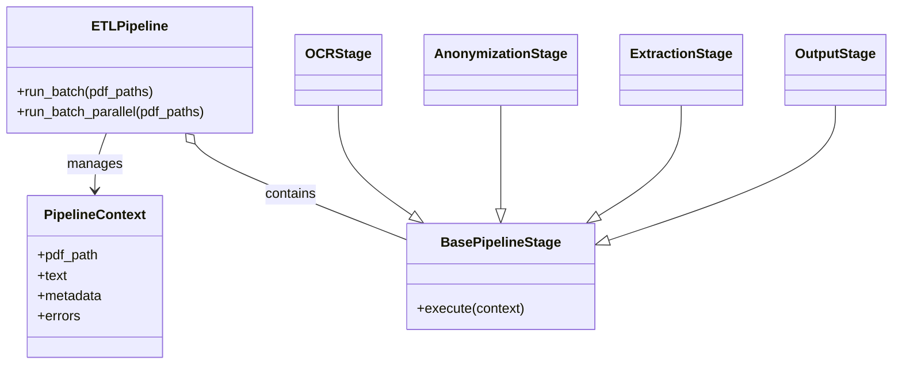

# Medical Report ETL System: Feature Analysis

This document provides a deep technical analysis of the Medical Report ETL System, detailing the architecture, execution flow, and implementation of core features.

## 1. System Overview

The system is a linear ETL (Extract, Transform, Load) pipeline designed to process scanned medical PDF reports.

**Core Responsibilities:**
*   **Extract**: Convert PDF images to text using OCR.
*   **Transform**: Anonymize PII and extract structured clinical metadata.
*   **Load**: Generate redacted PDFs and a structured JSON dataset.

**Key Technologies:**
*   **OCR**: `poppler` (PDF to Image) + `tesseract` (Image to Text).
*   **Processing**: Python class-based pipeline.
*   **Concurrency**: `concurrent.futures.ProcessPoolExecutor` for batch processing.

## 2. Architecture & Execution Flow

### High-Level Architecture
The system follows a **Pipeline Pattern**. A central `ETLPipeline` orchestrator passes a `PipelineContext` object through a series of `BasePipelineStage` implementations.



### Execution Flow (Happy Path)

1.  **Entry Point (`main.py`)**:
    *   Loads configuration (`Settings`).
    *   Initializes all services (OCR Engine, Redactor, Extractor).
    *   Constructs the `ETLPipeline` with list of stages.
    *   Dispatches processing (Sequential or Parallel).

2.  **Pipeline Orchestration (`src/pipeline/orchestrator.py`)**:
    *   `run_single(pdf_path)` creates a fresh `PipelineContext`.
    *   Context is passed sequentially through:
        1.  `OCRStage`
        2.  `AnonymizationStage`
        3.  `ExtractionStage`
        4.  `OutputStage`
    *   Resulting contexts are collected.
    *   Metadata from successful contexts is aggregated.

3.  **Parallel Execution**:
    *   Uses `ProcessPoolExecutor`.
    *   **Crucial Detail**: Initializes workers with `OMP_THREAD_LIMIT=1` to prevent Tesseract from oversubscribing threads when running multiple worker processes.

## 3. Core Feature Implementation

### A. OCR (`src/features/ocr/`)
*   **Engine**: `OCREngine` treats PDF conversion and text extraction as separate concerns.
*   **PDF Conversion**: `PDFConverter` uses `pdf2image` to render PDF pages as PIL Images. High DPI (default 300) is used for quality.
*   **Text Extraction**: `TextExtractor` wraps `pytesseract`. It processes images individually and joins them with newlines.

### B. Anonymization (`src/features/anonymization/`)
*   **Logic**: `PIIRedactor` applies a list of regex patterns sequentially.
*   **Registry**: `PIIPatternRegistry` holds definitions for `patient_name`, `patient_id`, etc.
*   **ID Management**: `UUIDMappingService` maintains a persistent `json` map of `original_id` -> `uuid`. This ensures the same patient always gets the same anonymized ID across different runs.

### C. Metadata Extraction (`src/features/metadata/`)
*   **Pattern**: Strategy Pattern. `MetadataExtractor` holds a list of `BaseExtractor` strategies.
*   **Handlers**:
    *   `GestationalAgeextractor`: Regex for "Weeks+Days".
    *   `FindingsExtractor`: Captures multiline text between "Examination Findings" and "Conclusion".
*   **Validation**: Each extractor has a `validate()` method to ensure data quality before attaching to the context.

### D. Output Generation (`src/features/output/`)
*   **PDF**: `PDFGenerator` uses `fpdf` to rebuild the report.
    *   *Note*: It creates a **new** PDF from the text, it does NOT redact the original image. This results in a text-only output, losing original formatting/layout.
*   **JSON**: `JSONSerializer` flattens the metadata. It adds backward-compatible aliases (e.g., `demographic_age` alongside `age`).

## 4. Key Data Structures

### PipelineContext (`src/pipeline/context.py`)
State container passed between stages.
*   `original_text`: Raw OCR output.
*   `anonymized_text`: Text after redaction.
*   `metadata`: Dictionary for extracted fields.
*   `errors`: List of validation or processing errors.

### Patient Metadata Schema
```json
{
  "patient_id": "UUID-v4",
  "gestational_age": "24w 3d",
  "age": 32,
  "demographic_age": 32,
  "BMI": 24.5,
  "findings": ["Clean scan", "No anomalies"],
  "examination_findings": ["Clean scan", "No anomalies"]
}
```

## 5. Improvement Opportunities / Technical Debts

1.  **PDF Generation**: Rebuilding the PDF from text (`fpdf`) destroys the original layout. A better approach would be drawing redacting rectangles over the original PDF coordinates.
2.  **Regex Fragility**: Extraction relies heavily on specific headers (e.g., "Conclusion"). Variations in report format will break extraction.
3.  **Memory Usage**: `pdf2image` loads all pages of a PDF into memory as images. For very large reports, this could OOM.
4.  **Error Handling**: If a single stage fails, the context records the error, but subsequent stages might still attempt execution or crash if they assume pre-requisites (though the pipeline seems to handle this via `has_errors()` checks).

